# xreaUnityURP
XREA Team Project: Unity 2020.3.12f1 

## 환경
- 버전: 2020.3.12f1
- 초기 세팅 환경: 3D
- 추가 패키지(Package Manager에서 import): Universal Render Pipeline, AR Foundation, ARCore XR Plugin, ARKit, AR Kit Face Tracking
- 쉐이더: Universal Rendering Pipeline 사용
- Build settings: Delete Vulkan(android), Android API 24이상, Delete Multithread rendering, Select ArCore / ArKit, 
- iOS Build
  1. Project Settings > Player : Select 'Requires ArKit Support' (arkit/ios)
  2. Delete Multithread Rendering
  3. Project Settings > XR-Plugin : ARKit Select
  4. Code 상단에 `using UnityEngine.XR.ARSubsystems; using UnityEngine.XR.ARKit;` 반드시 추가
  5. Scene 선택 후, Build And Run => 정상 빌드 되면 XCode 자동 실행 => 연결 Device 확인 => Build 하는 프로필:  애플 개발자 계정 필수 (유료): Signing/Certificate 탭에서 오피셜 계정 선택 (Personal Team 같은 계정 노노) => 내가 연결한 디바이스: 현 개발자 계정의 기기 리스트에 등록되어야 함 (전화 인증 필요할 수도), 디바이스 자체 내에서 애플 아이디 로그인 상태여야 함 => 정상 등록 & 개발자 계정 선택 제대로 되어 있으면 빌드 완료

## hololens2 build
- Unity Asset Store: https://assetstore.unity.com/packages/templates/packs/vuforia-hololens-1-2-sample-for-unity-2020-2-and-later-183725

- https://docs.microsoft.com/en-us/windows/mixed-reality/mrtk-unity/configuration/usingupm?view=mrtkunity-2021-05
- https://docs.microsoft.com/ko-kr/windows/mixed-reality/develop/install-the-tools?tabs=unity
- https://github.com/Microsoft/MixedRealityToolkit-Unity/releases
- https://docs.microsoft.com/en-us/windows/mixed-reality/develop/unity/welcome-to-mr-feature-tool
- https://docs.microsoft.com/en-us/windows/mixed-reality/develop/platform-capabilities-and-apis/using-the-hololens-emulator
- https://docs.microsoft.com/en-us/windows/mixed-reality/develop/platform-capabilities-and-apis/using-the-windows-mixed-reality-simulator
- https://library.vuforia.com/articles/Solution/Working-with-the-HoloLens-sample-in-Unity.html
- https://developer.vuforia.com/downloads/sdk
- https://kimyc1223.github.io/2020-12-11-HoloLens006/

## 세팅 방법

- 참고: Build Settings => 하단 버튼의 Player Settings 클릭하면 자동으로 Project Settings 창의 Player 메뉴가 뜸.

### 필수 패키지 import
#### Windows 메뉴 > Package Manager 선택 > Package: Unity Registry 탭 선택
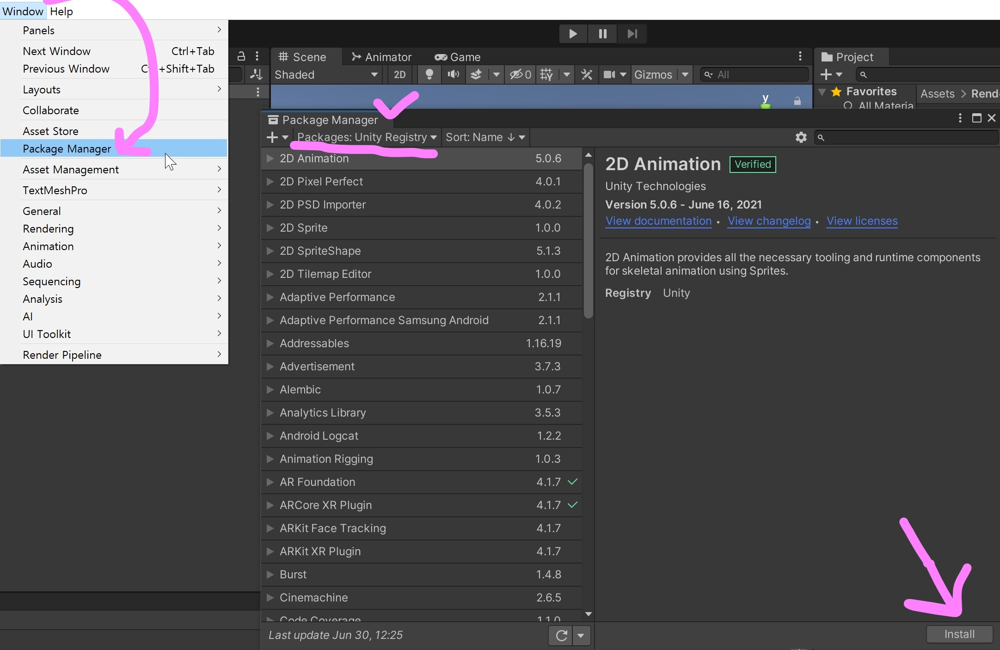
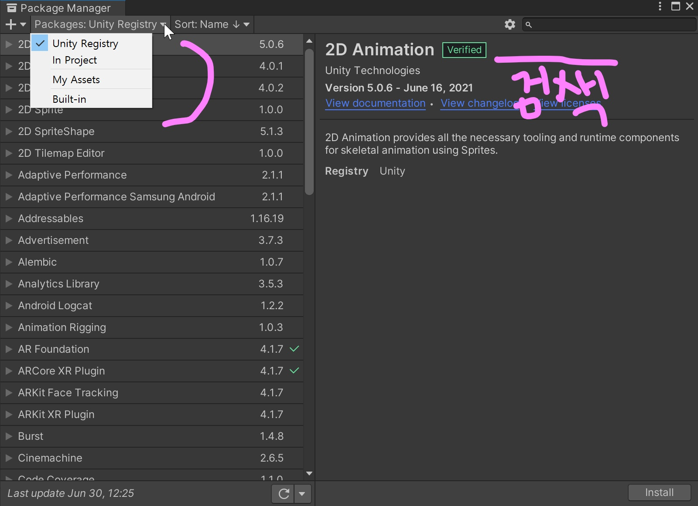
#### AR Foundation 필수 설치. 안드로이드 빌드위해 필요: ARCore XR Plugin, iOS 애플 빌드위해 필요: ARKit XR Plugin, ARKit Face Tracking
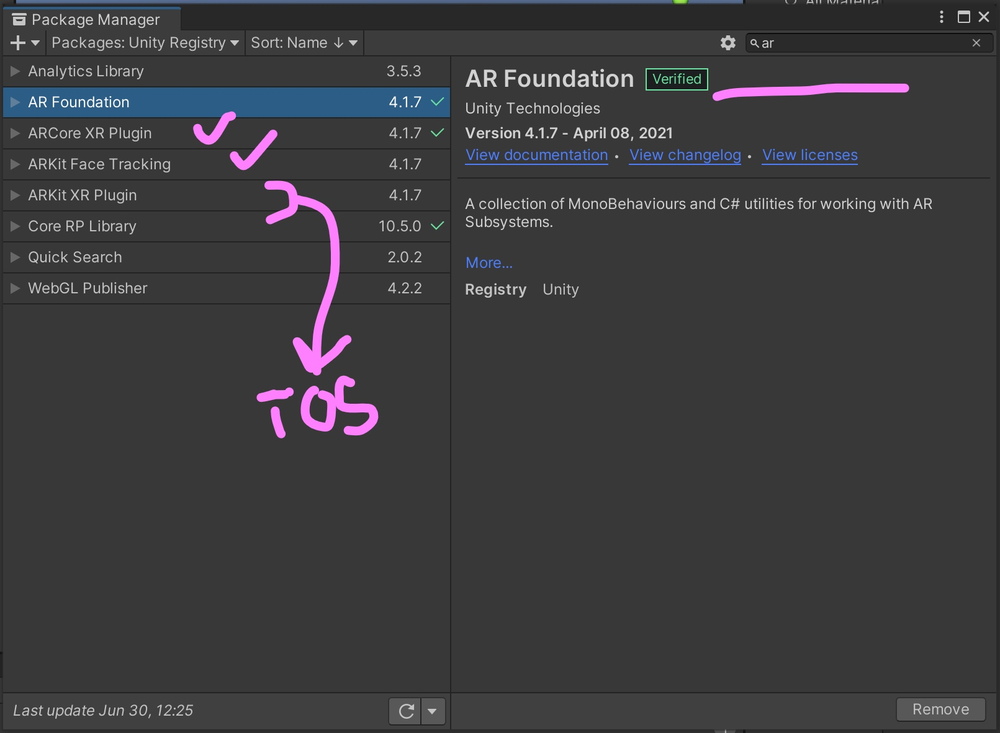
#### URP 패키지
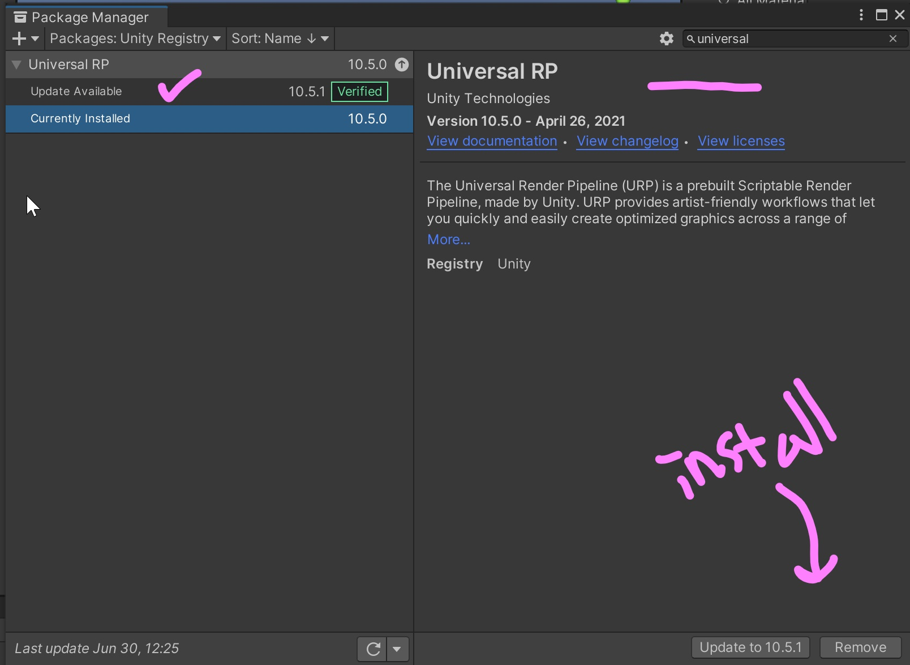

### 빌드와 프로젝트 세팅 : Build Settings, Project Settings, Player Settings 
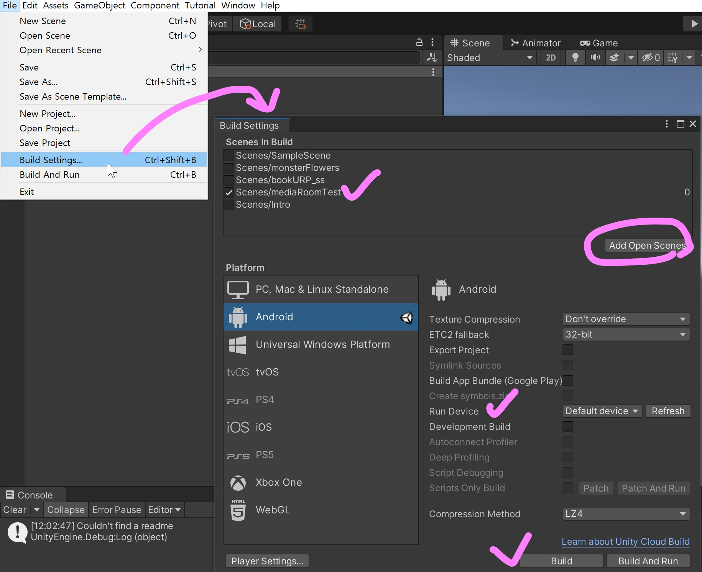
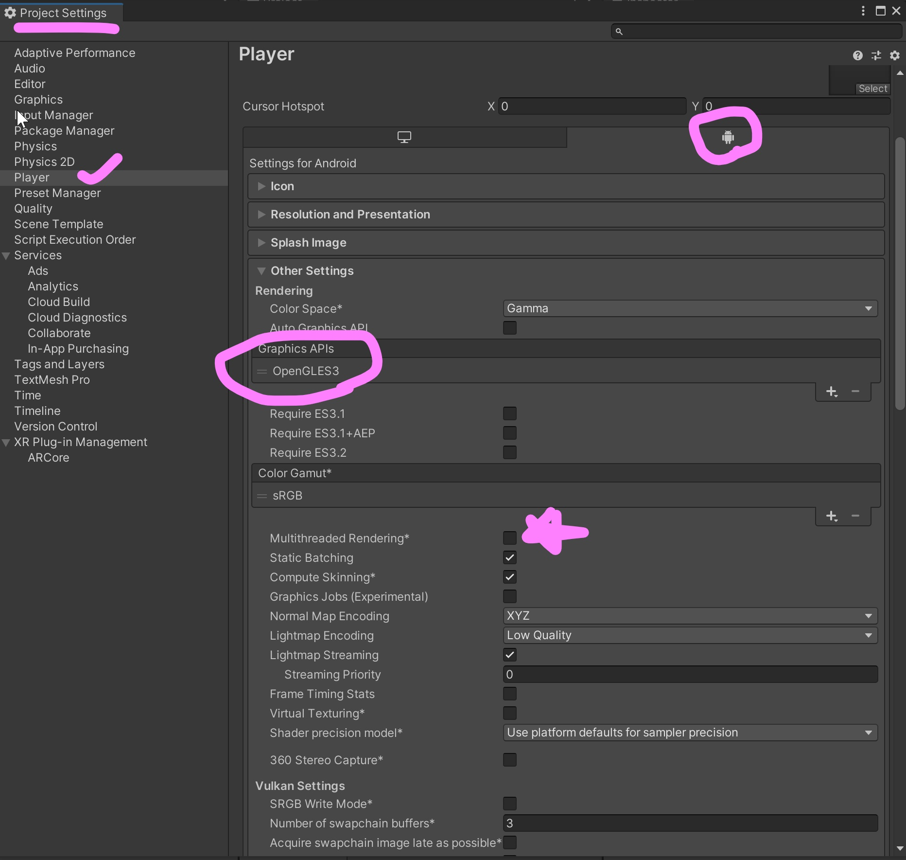

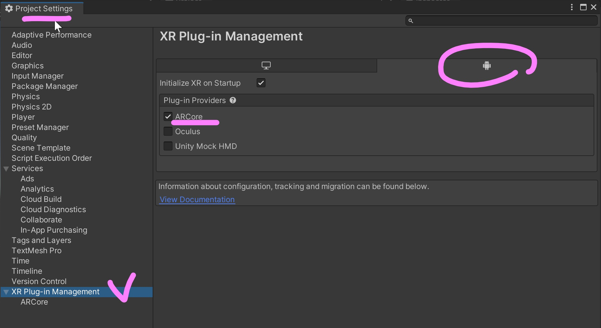

### URP 쉐이더 세팅 & 프로젝트 세팅

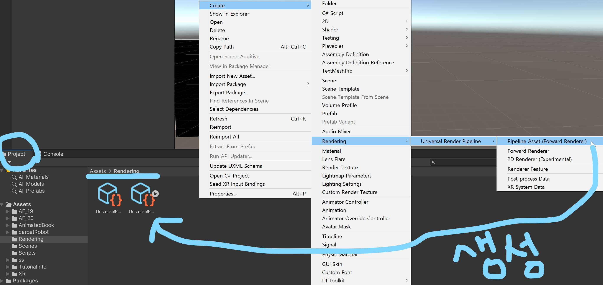
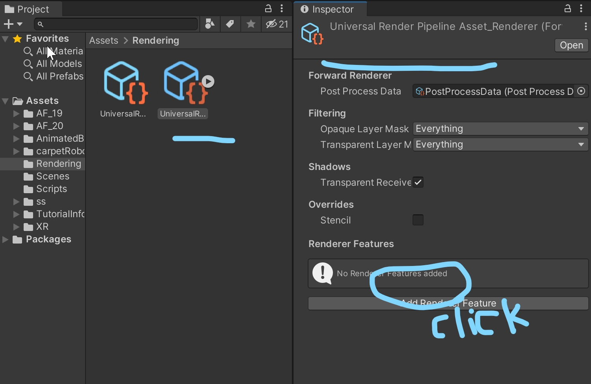
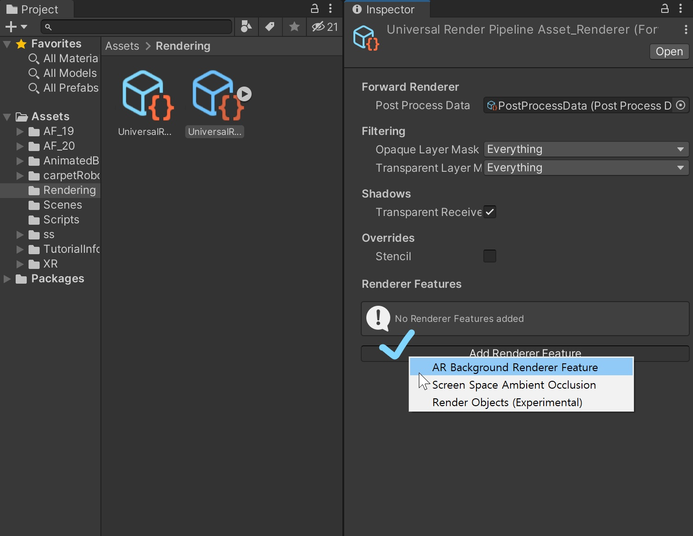
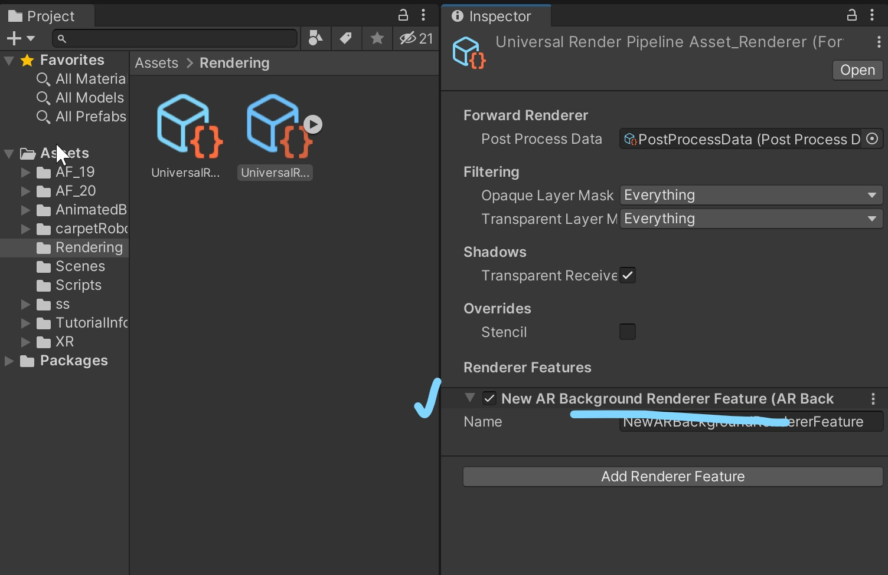
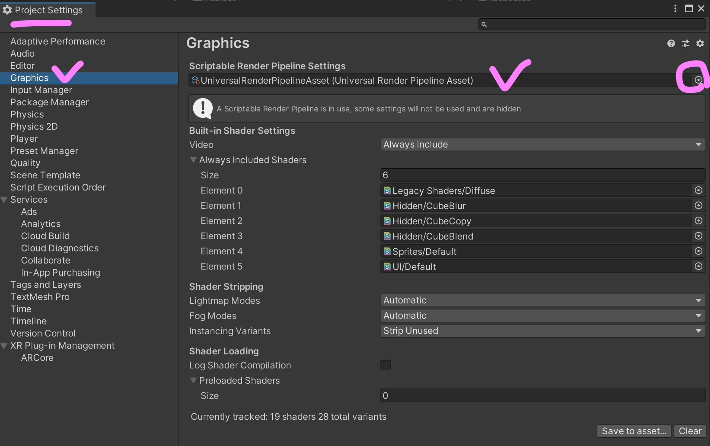
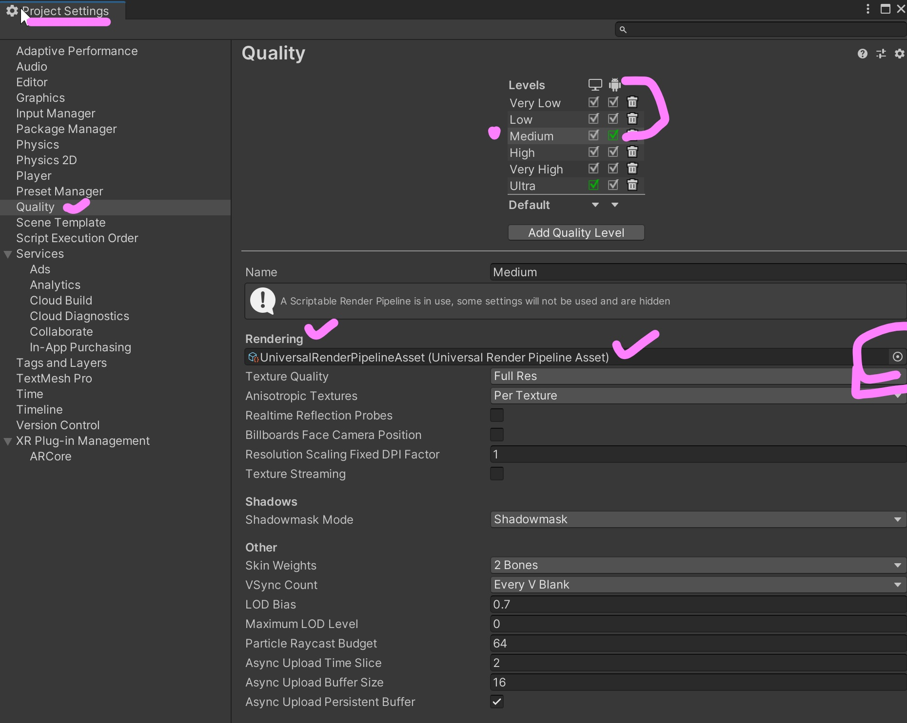

## 빌드 참고 영상
- [AR + URP](https://www.youtube.com/watch?v=yW34SiaXH7Q)
- [안드로이드 빌드](https://www.youtube.com/watch?v=gi9iHTY9z1o&t=602s)
- [iOS 빌드](https://www.youtube.com/watch?v=0g7tFKEbBNg&t=204s)

## github & unity
- https://unityatscale.com/unity-version-control-guide/how-to-setup-unity-project-on-github/
