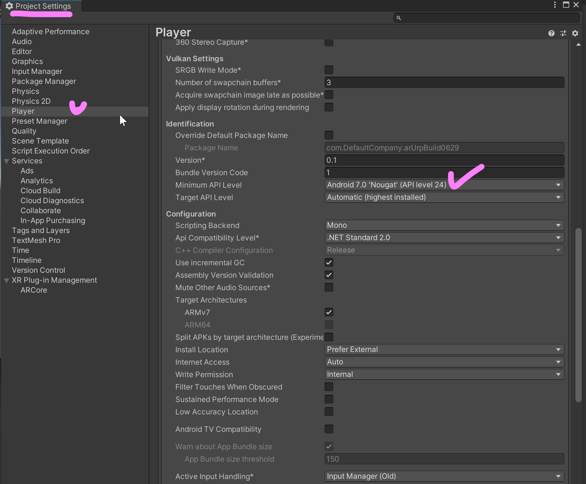

# xreaUnityURP
XREA Team Project: Unity 2020.3.12f1 

## 디렉토리 설명
- 메인 프로젝트: arUrpScenes
- 이전 프로젝트: xx_old_version

## 환경
- 버전: 2020.3.12f1
- 초기 세팅 환경: 3D
- 추가 패키지(Package Manager에서 import): Universal Render Pipeline, AR Foundation, ARCore XR Plugin, ARKit, AR Kit Face Tracking
- 쉐이더: Universal Rendering Pipeline 사용
- Build settings: Delete Vulkan(android), Android API 24이상, Delete Multithread rendering, Select ArCore / ArKit, Select 'Requires ArKit Support' (arkit/ios)

## 세팅 방법

- 참고: Build Settings => 하단 버튼의 Player Settings 클릭하면 자동으로 Project Settings 창의 Player 메뉴가 뜸.

### 필수 패키지 import
#### Windows 메뉴 > Package Manager 선택 > Package: Unity Registry 탭 선택

#### AR Foundation 필수 설치. 안드로이드 빌드위해 필요: ARCore XR Plugin, iOS 애플 빌드위해 피룡: ARKit XR Plugin, ARKit Face Tracking

#### URP 패키지

### 빌드와 프로젝트 세팅 : Build Settings, Project Settings, Player Settings 

### URP 쉐이더 세팅 & 프로젝트 세팅

## 빌드 참고 영상
- [AR + URP](https://www.youtube.com/watch?v=yW34SiaXH7Q)
- [안드로이드 빌드](https://www.youtube.com/watch?v=gi9iHTY9z1o&t=602s)
- [iOS 빌드](https://www.youtube.com/watch?v=0g7tFKEbBNg&t=204s)

## github & unity
- https://unityatscale.com/unity-version-control-guide/how-to-setup-unity-project-on-github/
